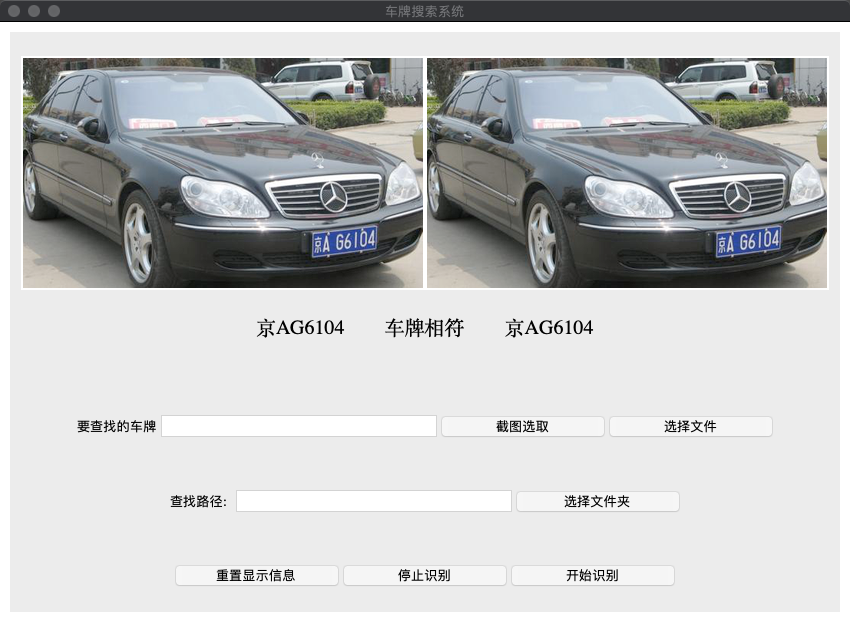
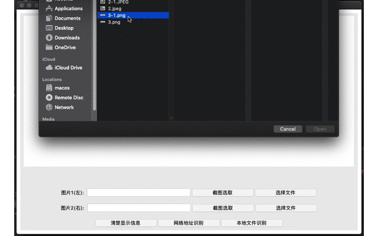
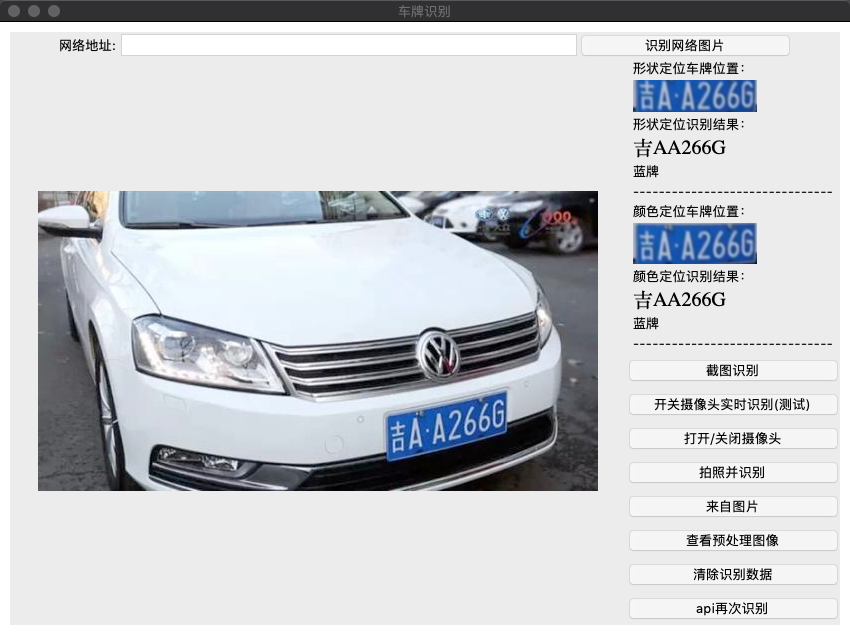
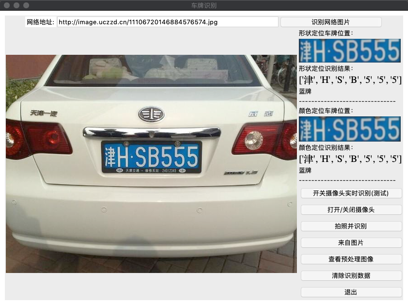
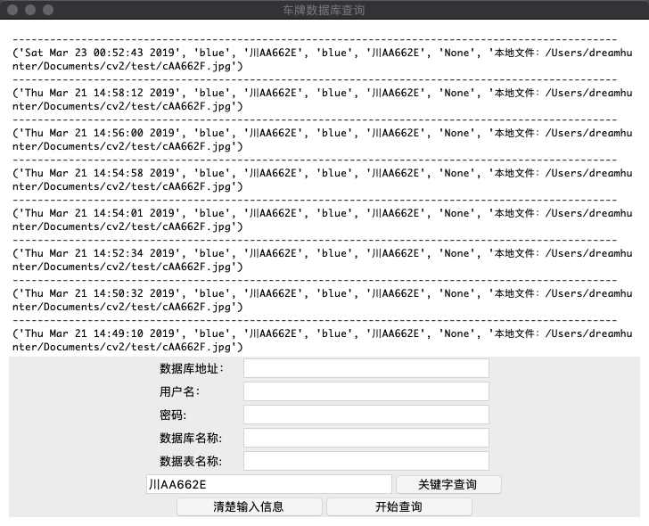
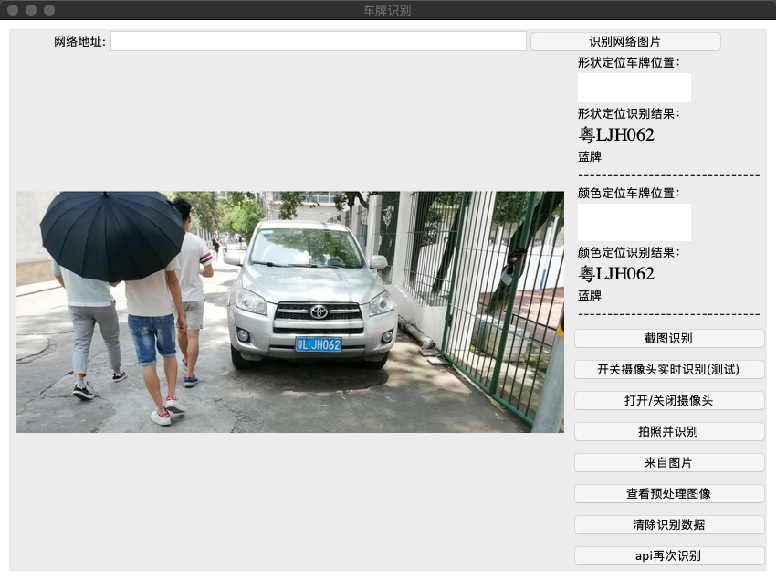
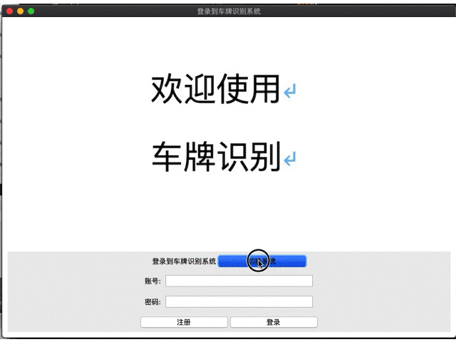
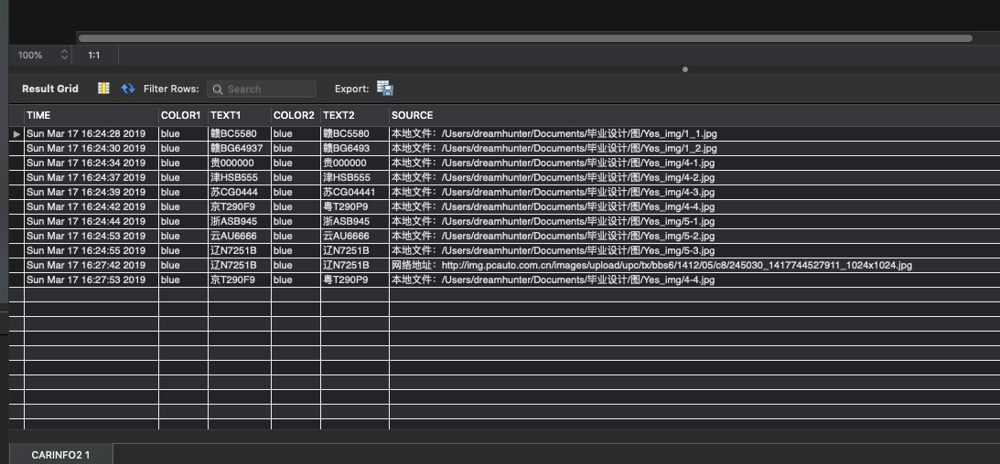
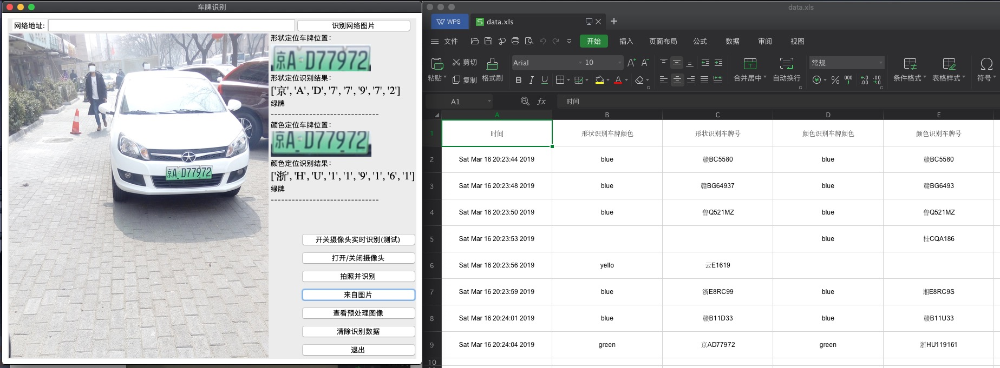
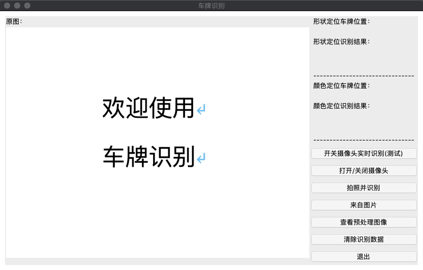

# Python opencv 车牌识别
[   ](https://github.com/jinmu333/python_PlateRecogntion)
[](https://github.com/996icu/996.ICU)
## 简介  [原理简介](doc/doc.md)

****

* 车牌搜索识别找出某个车牌号
* 对比识别车牌系统
* 车牌数据库认证系统
* 车牌图文搜索系统
* 车牌数据库搜索系统
* 文件图片识别车牌
* 网络图片地址识别车牌
* 实时截图识别车牌
* 图片自适应窗口大小
* 摄像头拍照识别车牌
* 使用 [hyperlpr](https://github.com/zeusees/HyperLPR) 提高识别率

****

* 毕业设计基于Opencv的车牌识别系统 
* 安装 python3.7
* 使用hyperlpr提高识别率 
* 两种方法都无法识别时调用百度api(有手动按钮)

****

## 开发环境配置
``` bash

# 按顺序安装
pip3 install -U pip

pip3 install hyperlpr

pip3 install numpy

pip3 install opencv-python

pip3 install pillow

pip3 install xlutils

pip3 install pymysql

pip3 install requests

pip3 install xlutils

```

## 运行演示

[百度api网址](https://cloud.baidu.com/product/ocr)

``` bash
# 首次运行修改 img_api.py中的 ID,KEY的配置信息为自己百度api信息 
INFO_CONFIG = {
    'ID': ' ',
    'API_KEY': ' ',
    'SECRET_KEY': ' '
}
# 运行
# 查看img_sql.py文件 数据库相关改为自己的(地址，用户名。密码，数据库名字)
# db = pymysql.connect("localhost", "python", "Python12345@", "chepai")
# GRANT ALL PRIVILEGES ON *.* TO 'username'@'localhost'
mysql.server start

# 运行登录界面
python3 login.py

# 运行主界面
python3 main.py

# 运行车牌对比识别主界面
python3 match.py

# 运行车牌搜索识别主界面
python3 search.py

# 运行车牌认证主界面
python3 identification.py

# 运行车牌数据库搜索主界面
python3 search_sql.py

```

* [android数据库查询软件](https://github.com/jinmu333/android_sql)

## 图片展示
### 车牌搜索识别找出某个车牌号

### 车牌对比识别前后是否一致

### 主界面

### 网络图片识别

### 车牌认证

### 车牌数据库搜索

### 两种方法都无法识别时百度api(有手动按钮)

### 登录注册页面

### 运行数据写入数据库

### 本次运行数据写入excel (data.xls)

### 欢迎界面
