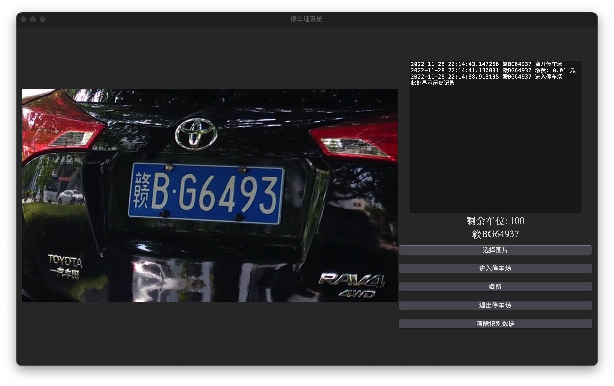

# Python opencv 车牌识别

车牌数据来源于网络，侵删

[   ](https://github.com/jinmu333/python_PlateRecogntion)
[](https://github.com/996icu/996.ICU)

- [Python opencv 车牌识别](#python-opencv-车牌识别)
  - [简介](#简介)
  - [开发环境配置](#开发环境配置)
    - [docker 开发环境搭建](#docker-开发环境搭建)
    - [macos 开发环境搭建](#macos-开发环境搭建)
    - [windows 快速搭建环境](#windows-快速搭建环境)
      - [安装 python3.6](#安装-python36)
      - [下载 mysql 便携版](#下载-mysql-便携版)
  - [安装依赖](#安装依赖)
  - [运行演示](#运行演示)
  - [图片展示](#图片展示)
    - [车牌搜索识别找出某个车牌号](#车牌搜索识别找出某个车牌号)
    - [车牌对比识别前后是否一致](#车牌对比识别前后是否一致)
    - [主界面](#主界面)
    - [停车场系统](#停车场系统)
    - [网络图片识别](#网络图片识别)
    - [车牌认证](#车牌认证)
    - [车牌数据库搜索](#车牌数据库搜索)
    - [两种方法都无法识别时百度api(有手动按钮)](#两种方法都无法识别时百度api有手动按钮)
    - [登录注册页面](#登录注册页面)
    - [运行数据写入数据库](#运行数据写入数据库)
    - [本次运行数据写入excel (data.xls)](#本次运行数据写入excel-dataxls)
    - [欢迎界面](#欢迎界面)

## 简介

**[点击查看原理简介](doc/doc.md)**

毕业设计基于Opencv的车牌识别系统

- 车牌搜索识别找出某个车牌号
- 对比识别车牌系统
- 车牌数据库认证系统
- 车牌图文搜索系统
- 车牌数据库搜索系统
- 文件图片识别车牌
- 网络图片地址识别车牌
- 实时截图识别车牌
- 图片自适应窗口大小
- 摄像头拍照识别车牌
- 使用 [hyperlpr](https://github.com/zeusees/HyperLPR) 提高识别率

## 开发环境配置

你可以选择使用 docker 搭建，或者 本地搭建环境，Linux 搭建，我相信不用介绍配置环境

这里仅介绍 `docker 开发环境搭建` 和 `windows 快速搭建环境`， 你也可以自己手动安装依赖

### docker 开发环境搭建

[点此查看 docker 开发环境搭建](/docker/readme.md)

### macos 开发环境搭建

```bash
brew install tcl-tk pyenv
# macos 12 最低只能安装此版本
pyenv install 3.7.13
brew install mysql@5.7
mysql.server start --skip-grant-tables
mysql -uroot
CREATE USER 'python'@'%' IDENTIFIED BY 'Python12345@';
CREATE database chepai;
GRANT ALL PRIVILEGES ON *.* TO 'python'@'%';
```

### windows 快速搭建环境

#### 安装 python3.6

安装 python3.6 [https://www.python.org/downloads/release/python-366/](https://www.python.org/downloads/release/python-366/)

#### 下载 mysql 便携版

[https://github.com/jinmu333/python_PlateRecogntion/releases/download/v0.0.1/mysql-server-winx64.zip](https://github.com/jinmu333/python_PlateRecogntion/releases/download/v0.0.1/mysql-server-winx64.zip)

解压后，cmd 执行 start.bat

## 安装依赖

``` bash
# 创建虚拟环境
python3 -m venv ./venv
# 安装依赖
./venv/bin/python3 -m pip install -r requirements.txt
```

## 运行演示

[点击申请百度 api 网址](https://cloud.baidu.com/product/ocr)

首次运行拷贝 .env.sample 到 .env

使用前面的 docker 开发可跳过此步骤，请看 docker 文件夹下的文档

修改 .env 文件中的配置信息为自己百度api信息

修改 .env 文件中数据库相关改为自己的(地址，用户名。密码，数据库名字)

``` bash
# 运行登录界面
python3 login.py

# 运行主界面
python3 main.py

# 运行车牌对比识别主界面
python3 match.py

# 运行车牌搜索识别主界面
python3 search.py

# 运行车牌认证主界面
python3 identification.py

# 运行车牌数据库搜索主界面
python3 search_sql.py

# 运行 停车场系统
python3 park.py
```

- [android数据库查询软件](https://github.com/jinmu333/android_sql)

## 图片展示

### 车牌搜索识别找出某个车牌号


### 车牌对比识别前后是否一致


### 主界面


### 停车场系统



### 网络图片识别


### 车牌认证


### 车牌数据库搜索


### 两种方法都无法识别时百度api(有手动按钮)


### 登录注册页面


### 运行数据写入数据库


### 本次运行数据写入excel (data.xls)


### 欢迎界面


